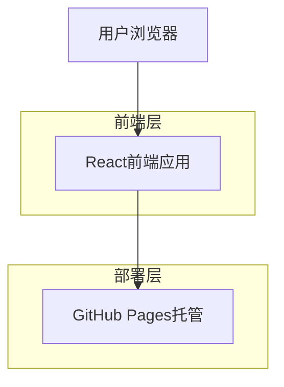
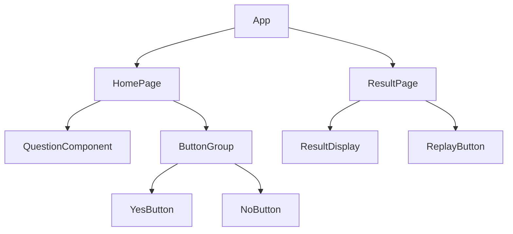

## 1. 架构设计



## 2. 技术描述

- **前端**: React@18 + Vite + CSS3动画
- **初始化工具**: vite-init
- **部署**: GitHub Pages
- **后端**: 无（纯静态页面）

## 3. 路由定义

| 路由 | 用途 |
|-------|------|
| / | 主游戏页，显示互动问题和按钮 |
| /result | 结果页，显示"你就是猪！"结果 |

## 4. 状态管理

### 4.1 组件状态
```typescript
interface GameState {
  yesButtonSize: number;  // "是"按钮大小（百分比）
  noButtonSize: number;   // "不是"按钮大小（百分比）
  clickCount: number;     // 点击次数
}
```

### 4.2 页面导航
使用React Router进行页面跳转：
```typescript
// 主游戏页到结果页
navigate('/result');

// 结果页返回主游戏页
navigate('/');
```

## 5. 组件架构



## 6. 样式设计

### 6.1 CSS变量定义
```css
:root {
  --primary-pink: #FFB6C1;
  --light-pink: #FFE4E1;
  --dark-pink: #FF69B4;
  --white: #FFFFFF;
  --shadow: rgba(255, 182, 193, 0.3);
}
```

### 6.2 动画效果
```css
/* 按钮缩放动画 */
@keyframes bounce {
  0%, 100% { transform: scale(1); }
  50% { transform: scale(1.1); }
}

/* 按钮悬停效果 */
.button:hover {
  animation: bounce 0.3s ease-in-out;
  box-shadow: 0 5px 15px var(--shadow);
}
```

## 7. GitHub Pages部署配置

### 7.1 构建配置
```json
{
  "homepage": "https://[username].github.io/[repository-name]",
  "scripts": {
    "build": "vite build",
    "deploy": "npm run build && gh-pages -d dist"
  }
}
```

### 7.2 部署步骤
1. 创建GitHub仓库
2. 配置vite.config.ts的base路径
3. 安装gh-pages依赖
4. 运行部署命令
5. 在GitHub仓库设置中启用GitHub Pages